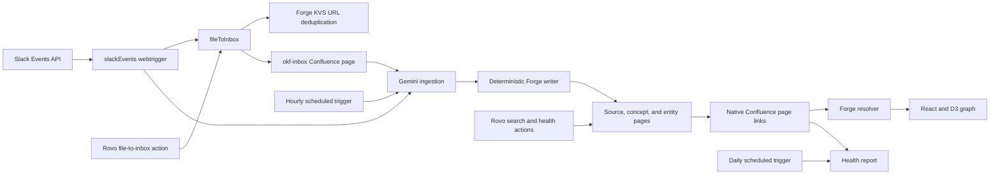

# Knowledge Graph for Confluence

> **Project status:** working internal technical demo. This repository proves the end-to-end approach on a controlled Atlassian development site. It is not a production service, is not intended for live users, and should only be run with disposable demo data.

This Forge app turns linked Confluence pages into an explorable knowledge graph. It can capture a URL from Slack or Rovo, use Gemini to distill the source into structured knowledge, write cross-linked concept, entity, and source pages, visualize those relationships, and report graph-quality problems.

The important claim is deliberately narrow: **the complete vertical slice works on Atlassian Forge and demonstrates enough of the product and engineering approach for a team to take forward.**

## What the demo proves

- A Forge Custom UI global page can render an interactive D3 graph from native Confluence pages and links.
- A signed Slack event can create a deduplicated inbox page and start ingestion immediately.
- Gemini can perform the non-deterministic distillation step while Forge code retains deterministic control over page creation, reuse, labeling, and linking.
- Scheduled Forge functions can retry pending ingestion and maintain a human-readable graph-health report.
- Rovo actions can search the graph, report stored health, and file a URL into the same inbox pipeline.
- The same Confluence content remains useful without the visualization or AI layer because pages, labels, and links are all native.

## Architecture



### Knowledge model

Confluence labels classify nodes. Native page links define edges; there is no second relationship database to synchronize.

| Label | Meaning | Graph color |
|---|---|---|
| `okf-concept` | A durable idea, method, or pattern | Purple |
| `okf-entity` | A person, organization, product, or named work | Green |
| `okf-source` | A distilled article, paper, note, or video | Yellow |
| `okf-inbox` | A captured source waiting for ingestion | Blue |
| No OKF label | A normal Confluence page | Gray |

The graph reports two useful quality signals:

- **Orphan:** a page with no incoming or outgoing page links. Inbox pages are excluded because they are intentionally temporary.
- **Unresolved link:** a link whose target page does not exist in the selected space.

### Capture and ingestion flow

1. Slack sends a channel message event to the `slack-events` webtrigger, or Rovo invokes `file-to-inbox`.
2. The app extracts the URL, chooses the requested space or first watched space, and uses a URL hash in Forge KVS to prevent duplicates.
3. Forge creates an `okf-inbox` page containing the source URL, sharing context, and any deterministically captured source text.
4. The Slack path attempts ingestion immediately. The hourly trigger retries one pending inbox page per run.
5. Gemini 2.5 Flash returns structured JSON containing a title, summary, key points, concepts, and entities.
6. Forge code reuses matching pages, creates missing pages, writes native links, applies labels, and marks the inbox page as ingested.
7. The app allows three ingestion attempts; the next sweep retires a repeatedly failing item with the `okf-ingest-failed` label.

Gemini does not write to Confluence. It only proposes structured content; the deterministic Forge layer owns all persistence and graph construction.

### Graph and maintenance flow

The Custom UI invokes Forge resolvers through `@forge/bridge`. Its Confluence operations and Rovo search use `api.asUser()`, so they execute in the current user's product context. Scheduled jobs, the Slack bridge, and the shared inbox writer use `api.asApp()` because those paths must also operate without an interactive Confluence request.

The graph builder reads pages, labels, and storage-format page links, then produces nodes, edges, orphan flags, unresolved links, and summary counts. The daily maintenance function runs the same graph analysis for watched spaces, stores the latest result in KVS, and creates or updates a `Knowledge Graph Health` page.

## Start reading here

The shortest useful review path is:

1. [`manifest.yml`](manifest.yml) for every Forge module, function, permission, resource, and runtime setting.
2. [`src/index.js`](src/index.js) for the handler wiring.
3. [`src/resolvers.js`](src/resolvers.js), [`src/lib/confluence.js`](src/lib/confluence.js), and [`src/lib/graph.js`](src/lib/graph.js) for the interactive graph path.
4. [`static/graph/src/App.js`](static/graph/src/App.js) and [`static/graph/src/App.css`](static/graph/src/App.css) for the graph experience.
5. [`src/slack-bridge.js`](src/slack-bridge.js), [`src/inbox.js`](src/inbox.js), and [`src/ingest.js`](src/ingest.js) for the complete capture-to-knowledge path.
6. [`src/maintenance.js`](src/maintenance.js), [`src/rovo.js`](src/rovo.js), and [`src/seed.js`](src/seed.js) for health checks, Rovo actions, and the repeatable demo dataset.

| Path | Responsibility |
|---|---|
| `manifest.yml` | Confluence global page, scheduled triggers, Rovo agent/actions, webtriggers, scopes, egress, and Node.js runtime |
| `src/index.js` | Exports the handlers named by the manifest |
| `src/resolvers.js` | Custom UI boundary for spaces, graph data, watch state, health checks, and demo seeding |
| `src/lib/confluence.js` | Confluence REST helpers for spaces, pages, labels, search, create, and update |
| `src/lib/graph.js` | Converts pages and native links into graph data and quality signals |
| `src/slack-bridge.js` | Slack signature verification, event filtering, metadata capture, and immediate ingest attempt |
| `src/inbox.js` | URL validation, KVS deduplication, and inbox-page creation |
| `src/ingest.js` | Gemini request, structured-output validation, page reuse/creation, links, labels, and retries |
| `src/maintenance.js` | Watched-space state, scheduled graph analysis, KVS health snapshots, and report-page writing |
| `src/rovo.js` | Rovo search and health action handlers |
| `src/seed.js` | Idempotent demo content, including intentional graph defects for the health-check story |
| `static/graph` | React 16 Custom UI and D3 force-directed visualization |

### Why Custom UI is used

The graph needs direct SVG rendering, D3's force simulation, drag, zoom, selection, and responsive canvas behavior. Custom UI is therefore a deliberate prototype choice for this module, not an accidental mixing of UI Kit components. The Forge resolver remains the product API boundary.

## Reviewer setup

### Prerequisites

- Node.js and npm
- [Atlassian Forge CLI](https://developer.atlassian.com/platform/forge/set-up-forge/), authenticated with `forge login`
- An Atlassian cloud development site with Confluence
- Rovo access only if reviewing the Rovo agent
- A Slack app only if reviewing Slack capture
- A Gemini API key only if reviewing automated distillation

Install dependencies and build the Custom UI from the repository root:

```sh
npm ci
npm --prefix static/graph ci
npm --prefix static/graph run build
forge lint
```

### Choose the Forge registration path

**Company reviewers using the existing app:** keep the `app.id` already present in `manifest.yml`. They must be granted access to that Forge app. They should not run `forge register`, because doing so replaces the manifest ID with a separate app registration.

**Reviewers creating an independent copy:** run the following once. It creates a new Forge app registration and updates the local manifest ID. The new app has separate environments, variables, installations, storage, and webtrigger URLs.

```sh
forge register knowledge-graph-review
```

The Forge app ID in `manifest.yml` identifies the app; it is not a credential.

### Runtime variables and API keys

**Cloning this repository does not provide any Gemini, Slack, or YouTube credential.** Secret values are not committed to Git. They live in environment-specific Forge encrypted variables and are not copied when someone registers a separate app.

| Variable | Needed for | Required? |
|---|---|---|
| `GEMINI_API_KEY` | Automated source distillation | Only for the AI ingest path |
| `SLACK_SIGNING_SECRET` | Authenticating Slack Events API requests | Only for Slack capture |
| `SLACK_BOT_TOKEN` | Resolving Slack user and channel names | Optional enrichment |
| `YOUTUBE_API_KEY` | Richer YouTube metadata during capture | Optional enrichment |

Set only the variables needed for the path under review:

```sh
forge variables set --encrypt -e development GEMINI_API_KEY YOUR_GEMINI_KEY
forge variables set --encrypt -e development SLACK_SIGNING_SECRET YOUR_SLACK_SIGNING_SECRET
forge variables set --encrypt -e development SLACK_BOT_TOKEN YOUR_SLACK_BOT_TOKEN
forge variables set --encrypt -e development YOUTUBE_API_KEY YOUR_YOUTUBE_KEY
```

Redeploy after changing Forge variables. Encrypted values cannot be recovered with `forge variables list`; replace them by setting them again.

Without `GEMINI_API_KEY`, Slack and Rovo can still create inbox pages, and the graph, seed data, search, and health-check paths still work. Automated ingestion safely reports that it was skipped.

### Deploy and install on a disposable development site

```sh
forge deploy --non-interactive -e development
forge install --non-interactive --site YOUR_SITE.atlassian.net --product Confluence --environment development
```

If this app is already installed and modules or scopes changed, upgrade the installation after deploying:

```sh
forge install --non-interactive --upgrade --site YOUR_SITE.atlassian.net --product Confluence --environment development
```

Code-only changes need a deploy but do not need an installation upgrade. Frontend changes must be built before deployment because `manifest.yml` serves `static/graph/build`.

## Slack capture setup

The demo uses a small custom Slack app and the Slack Events API.

Create the signed Slack endpoint after deploying and installing:

```sh
forge webtrigger create -f slack-events -s YOUR_SITE.atlassian.net -p Confluence -e development
```

Create a Slack app from this manifest and replace `YOUR_SLACK_WEBTRIGGER_URL` with the generated URL:

```yaml
display_information:
  name: Knowledge Graph Bridge
  description: Files shared links into the Confluence knowledge graph inbox
features:
  bot_user:
    display_name: kg-bridge
    always_online: true
oauth_config:
  scopes:
    bot:
      - channels:history
      - users:read
      - channels:read
settings:
  event_subscriptions:
    request_url: YOUR_SLACK_WEBTRIGGER_URL
    bot_events:
      - message.channels
```

Then:

1. Install the Slack app to the controlled demo workspace.
2. Store its signing secret and optional bot token as encrypted Forge variables.
3. Redeploy the Forge app.
4. Invite `@kg-bridge` to the controlled public channel.
5. Post a new URL with a short sentence explaining why it matters.

Slack event callbacks are verified with HMAC-SHA256 and rejected if the signature is invalid or the timestamp is more than five minutes old. Slack's initial `url_verification` challenge is returned before that check so the endpoint can be configured. Bot messages, message subtypes, and events without a user are ignored.

The webtrigger URL is a capability URL and should be treated as sensitive configuration even though the Slack handler also verifies Slack's signature.

## Optional on-demand ingest endpoint

The hourly job is the normal retry path. For a live demo, `ingest-now` can trigger the same sweep without waiting for the next scheduled invocation:

```sh
forge webtrigger create -f ingest-now -s YOUR_SITE.atlassian.net -p Confluence -e development
```

This endpoint is intentionally demo-only and has no application-level authentication. Keep its generated URL private, use it only on the disposable development site, and do not carry this pattern into a production design.

## Demo walkthrough

Use a new or disposable Confluence space.

1. Open **Apps -> Knowledge Graph**.
2. Select the demo space.
3. Choose **Seed demo data**. The seed operation reuses pages that already exist, so it is safe to repeat.
4. Explore the graph with search, type filters, orphan filtering, drag, zoom, node selection, and double-click navigation.
5. Choose **Watch this space** so scheduled ingestion and maintenance know which space to process.
6. Choose **Run health check**. The seeded data intentionally contains an orphan and an unresolved link so the report has something meaningful to find.
7. If Slack and Gemini are configured, share a previously unused URL in the demo channel. The bridge creates the inbox page and immediately attempts distillation.
8. Refresh the graph to show the new source, concept, and entity pages and their native Confluence links.
9. In Rovo, ask the **Knowledge Graph Agent** to find a seeded topic or report graph health.

Use a fresh URL when repeating the capture story. URL deduplication is intentional and persists in Forge KVS even if the related page is manually deleted.

## Validation and troubleshooting

Run the same lightweight checks used before handing off this demo:

```sh
forge lint
node --check src/index.js
node --check src/resolvers.js
node --check src/inbox.js
node --check src/ingest.js
node --check src/slack-bridge.js
npm --prefix static/graph run build
```

| Symptom | What to check |
|---|---|
| `GEMINI_API_KEY not set` | Set the encrypted variable in the same Forge environment and redeploy |
| Slack returns `401` | Confirm the signing secret, environment, request URL, and Slack app configuration |
| A shared URL is skipped | Use a new URL; the KVS deduplication record is doing its job |
| Inbox page exists but is not distilled | Confirm the Gemini key, inspect logs, then use the hourly job or private `ingest-now` URL |
| Frontend changes do not appear | Rebuild `static/graph`, then redeploy |
| Manifest/module changes do not appear | Deploy, then run `forge install --upgrade` for the installed site |
| Newly created content is briefly absent from search | Allow for Confluence indexing; direct page reads and the hourly retry path avoid relying only on immediate CQL visibility |

Recent development logs:

```sh
forge logs -n 100 -e development --since 15m
```

## Intentional demo boundary

This repository is a competent proof of capability, not a claim of production readiness. Its accepted demo constraints are:

- one controlled Atlassian development site, one controlled Slack workspace/channel, and disposable content;
- no live users, sensitive sources, production credentials, or production service-level expectations;
- broad backend egress so the bridge can read arbitrary shared URLs and call Slack, Google, YouTube, and Gemini;
- a capability URL for on-demand ingestion;
- synchronous Slack capture and immediate ingestion, optimized for a clear vertical-slice demo;
- bounded page loading and one scheduled inbox item per ingest invocation, which are sufficient for the demo dataset.

Those choices keep the proof simple and observable. A production engineering handoff would revisit authenticated job triggering, authorization and tenancy boundaries, an asynchronous capture queue, scoped egress and data-governance requirements, pagination and load testing, dependency modernization, accessibility, automated tests/CI, telemetry, retries, and operational runbooks.

## Additional context

- [`docs/why-this-matters.md`](docs/why-this-matters.md) explains the product rationale.
- [`docs/project-brief.md`](docs/project-brief.md) records the original project framing; where early assumptions differ from the implementation, this README, `manifest.yml`, and the current source are authoritative.
- [`docs/lessons-learned.md`](docs/lessons-learned.md) captures implementation notes and tradeoffs from the demo build.

Official Forge references:

- [Forge environments and encrypted variables](https://developer.atlassian.com/platform/forge/environments-and-versions/)
- [Registering a copied Forge app](https://developer.atlassian.com/platform/forge/cli-reference/register/)
- [Creating a webtrigger URL](https://developer.atlassian.com/platform/forge/cli-reference/webtrigger-create/)
- [Forge webtrigger security model](https://developer.atlassian.com/platform/forge/runtime-reference/web-trigger/)
